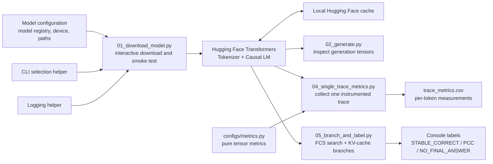
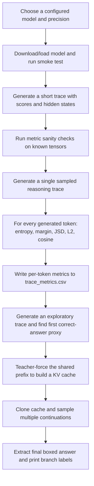

# LLM-Flip-Research — Stop Before the Flip

An experimental research prototype for studying **post-correctness collapse (PCC)** in large language model reasoning. PCC is the failure mode in which a model reaches a correct answer during its reasoning, continues generating tokens, and ultimately produces an incorrect final answer.

The repository currently focuses on the measurement and branching groundwork needed to study that behavior. It can load selected Hugging Face causal language models, inspect generation tensors, compute per-token distribution and hidden-state metrics, export a single trace to CSV, and create sampled continuations from a shared reasoning prefix. It does **not** yet implement a trained hazard predictor, an automatic stopping controller, benchmark-scale data collection, or an HTTP API.

## Project Overview

The central research question is:

> Can signals available at a reasoning prefix indicate that continuing generation is likely to turn a currently correct answer into an incorrect one?

The working experimental approach is:

1. Generate a reasoning trace for a problem with a known answer.
2. Locate the first point at which that answer appears in the model's reasoning. In this code, this is an oracle-style proxy for the **FCS boundary** (first-correct-solution boundary).
3. Measure token-level uncertainty and internal-state movement around the trace.
4. Reconstruct the model's key-value (KV) cache for the shared prefix, sample multiple continuations, and label final outcomes as stable correct or PCC.

This distinction matters: a useful system must avoid stopping productive self-correction (wrong → correct) while identifying harmful overthinking (correct → wrong).

## Implemented Capabilities

- Interactive selection of a configured Hugging Face model and precision mode (BF16, 8-bit, or 4-bit NF4).
- CUDA availability and GPU-memory reporting during a model download and generation smoke test.
- Inspection of `generate()` score and hidden-state tensor layouts, including the prefill versus cached-decoding distinction.
- Pure, unit-testable metrics for token entropy, top-two probability margin, Jensen–Shannon divergence, hidden-state L2 transition, and cosine similarity.
- Per-token trace export to CSV across early, middle, and late transformer layers.
- An exploratory same-prefix branching experiment based on cloned KV caches.
- Heuristic final-answer extraction and labels for `STABLE_CORRECT`, `PCC`, and `NO_FINAL_ANSWER` branches.

## Tech Stack

| Area | Technologies used in the current codebase |
| --- | --- |
| Language | Python |
| ML runtime | PyTorch (`torch`) |
| Model integration | Hugging Face Transformers (`AutoTokenizer`, `AutoModelForCausalLM`, `model.generate`) |
| Quantization | BitsAndBytes via `BitsAndBytesConfig` for 4-bit NF4 and 8-bit loading |
| Models configured | DeepSeek-R1-Distill-Qwen (1.5B/7B), DeepSeek-R1-Distill-Llama-8B, Qwen2.5-Math-1.5B-Instruct, MetaStone-S1-1.5B, and t0-s1-1.5B |
| Data output | CSV (`trace_metrics.csv`) and console output |
| Hardware target | CUDA-capable GPU; the instrumentation and branching scripts load models on CUDA |
| Python standard library | `csv`, `copy`, `logging`, `pathlib`, `re`, and `typing` |

There is no frontend, database, vector database, cloud service integration, authentication mechanism, or HTTP/REST API in the current repository.

## System Architecture

The repository is organized as a script-driven research workflow. `model_config.py` holds the model registry and local paths. The download script uses a small CLI helper and logger; the remaining experimental scripts load the current hard-coded DeepSeek 1.5B model directly.



### Component Responsibilities

| Component | Responsibility |
| --- | --- |
| [`project/configs/model_config.py`](project/configs/model_config.py) | Defines supported model IDs, a CUDA/CPU device setting, and local Hugging Face/output paths. |
| [`project/src/utils/cli.py`](project/src/utils/cli.py) | Presents the interactive model and precision prompts used by the smoke test. |
| [`project/src/utils/logger.py`](project/src/utils/logger.py) | Provides reusable console/file logging setup. |
| [`project/scripts/01_download_model.py`](project/scripts/01_download_model.py) | Downloads/loads a selected model, runs a short reasoning prompt, and reports cache size and peak CUDA allocation. |
| [`project/scripts/02_generate.py`](project/scripts/02_generate.py) | Documents and prints the shape behavior of generation scores and hidden states. |
| [`project/configs/metrics.py`](project/configs/metrics.py) | Implements scalar metrics over one token distribution or a pair of hidden states. |
| [`project/scripts/03_metrics_test.py`](project/scripts/03_metrics_test.py) | Checks the metric functions against controlled tensors. |
| [`project/scripts/04_single_trace_metrics.py`](project/scripts/04_single_trace_metrics.py) | Generates a sampled trace, computes metrics per token, and writes the CSV. |
| [`project/scripts/05_branch_and_label.py`](project/scripts/05_branch_and_label.py) | Searches for the first correct-answer proxy and samples matched continuations from a cloned cache. |
| [`project/scripts/debug_cache.py`](project/scripts/debug_cache.py) | Small diagnostic for trying two `past_key_values`/input arrangements. |

## Application and Data Flow

The normal development workflow is sequential: validate model access, verify tensor assumptions, validate metrics, inspect a trace, then attempt branching.



### Trace instrumentation flow

`04_single_trace_metrics.py` requests `output_scores=True` and `output_hidden_states=True` from `model.generate()`. For every generated token it:

1. decodes the selected token;
2. calculates entropy and top-two margin from that step's score vector;
3. calculates Jensen–Shannon divergence against the prior step's score vector;
4. selects the last hidden vector for early, middle, and final transformer layers;
5. calculates L2 distance and cosine similarity against the preceding vector at each selected layer; and
6. writes a row to `trace_metrics.csv`.

The committed CSV is a sample trace artifact, not a benchmark result or trained model output.

### Branching flow

`05_branch_and_label.py` uses one deliberately adversarial shirt-drying prompt with ground truth `1`. It searches decoded reasoning text for the answer while the `<think>` block is open, reconstructs a cache for that prefix, then generates ten high-temperature continuations. It identifies the last `\\boxed{...}` expression in each continuation and prints one of the three labels above. Results are retained only in process memory and printed; they are not saved as a dataset.

## Repository Structure

```text
.
├── README.md
├── .gitignore
├── trace_metrics.csv                 # Sample per-token metric output
├── walkthrough-download-model        # Notes for the downloader smoke test
└── project/
    ├── configs/
    │   ├── metrics.py                # Tensor-level metric functions
    │   └── model_config.py           # Model registry and local settings
    ├── scripts/
    │   ├── 01_download_model.py      # Interactive download/load smoke test
    │   ├── 02_generate.py            # Generation output inspection
    │   ├── 03_metrics_test.py        # Metric sanity tests
    │   ├── 04_single_trace_metrics.py # Single-trace CSV experiment
    │   ├── 05_branch_and_label.py    # Same-prefix branch experiment
    │   └── debug_cache.py            # KV-cache diagnostic
    └── src/
        └── utils/
            ├── cli.py                # Interactive selection prompts
            └── logger.py             # Logging utilities
```

## Getting Started

### Prerequisites

- Python with a PyTorch build compatible with the target machine.
- Internet access on the first run to download the selected Hugging Face model.
- A CUDA-capable GPU for the default experimentation scripts. `02_generate.py`, `04_single_trace_metrics.py`, `05_branch_and_label.py`, and `debug_cache.py` explicitly load models on CUDA.
- Sufficient disk space for model weights and a compatible GPU memory budget for the model/precision combination selected.

The current branch does not include a `requirements.txt`, lock file, `pyproject.toml`, Conda environment file, or Docker configuration. Install the libraries used by the code manually, choosing the appropriate PyTorch installation command for the machine and CUDA version.

### Installation

```bash
git clone https://github.com/utkarsh050505/LLM-Flip-Research.git
cd LLM-Flip-Research

python3 -m venv .venv
source .venv/bin/activate

python -m pip install --upgrade pip
# Install a PyTorch build appropriate for your CUDA platform first.
python -m pip install torch transformers accelerate bitsandbytes
```

On Windows PowerShell, activate the environment with:

```powershell
.\.venv\Scripts\Activate.ps1
```

`bitsandbytes` is needed for the 4-bit and 8-bit choices. `accelerate` supports the automatic device mapping used by the quantized loading path.

### Local configuration

Edit [`project/configs/model_config.py`](project/configs/model_config.py) before running the downloader. The committed values use Windows `A:\\LLMResearch\\...` paths and `DEVICE = "cuda"`; update them for the local machine.

```python
# project/configs/model_config.py
DEVICE = "cuda"  # Use "cpu" only for the downloader's CPU path
HF_CACHE_DIR = r"/absolute/path/to/hf_cache"
OUTPUT_DIR = r"/absolute/path/to/outputs"
```

The downloader displays its own interactive model and precision menus, so its selection does not depend on `ACTIVE_MODEL_KEY`. That constant remains available in the configuration but is not read by `01_download_model.py` for selection. The later experiment scripts directly hard-code `deepseek-ai/DeepSeek-R1-Distill-Qwen-1.5B` and CUDA; changing `model_config.py` alone does not reconfigure those scripts.

## Configuration and Environment Variables

No environment variables, `.env` file, credentials, API keys, or tokens are read by the current source code.

Configuration is currently source-file based:

| Setting | Location | Purpose |
| --- | --- | --- |
| `MODEL_REGISTRY` | `project/configs/model_config.py` | Maps supported model keys to Hugging Face IDs, family labels, and nominal 4-bit defaults. |
| `DEVICE` | `project/configs/model_config.py` | Chooses the downloader's CUDA or CPU loading branch. |
| `HF_CACHE_DIR` | `project/configs/model_config.py` | Local directory passed to Hugging Face for model/tokenizer caching. |
| `OUTPUT_DIR` | `project/configs/model_config.py` | Created on import; reserved for model outputs, logits, and hidden states. |
| Script constants | `project/scripts/02_generate.py`, `04_single_trace_metrics.py`, `05_branch_and_label.py` | Control prompts, model ID, token budgets, temperatures, output CSV path, and branching settings for each experiment. |

## Usage

Run commands from the repository root after configuring the environment.

### 1. Download and smoke-test a model

```bash
python project/scripts/01_download_model.py
```

The script asks for a model and precision mode, downloads any missing weights into `HF_CACHE_DIR`, generates a short arithmetic response, and reports cache size. In CUDA mode it also checks the GPU and reports peak allocated VRAM.

### 2. Inspect generation output shapes

```bash
python project/scripts/02_generate.py
```

This short run prints the structure of `outputs.scores` and `outputs.hidden_states`. It is intended to verify indexing assumptions before metric analysis.

### 3. Validate the metric implementations

```bash
python project/scripts/03_metrics_test.py
```

Expected behavior: each check prints `PASS`. This test requires PyTorch but does not download a model or use CUDA.

### 4. Generate a single instrumented trace

```bash
python project/scripts/04_single_trace_metrics.py
```

The script samples up to 400 new tokens for its configured train/car word problem and overwrites `trace_metrics.csv` in the repository root with fields including:

```text
step, token, entropy, top2_margin, jsd_vs_prev,
l2_early, cos_early, l2_mid, cos_mid, l2_late, cos_late
```

### 5. Run the exploratory branch experiment

```bash
python project/scripts/05_branch_and_label.py
```

This is computationally demanding: it may generate up to 12,000 tokens to locate the FCS proxy and up to 16,000 tokens for each of ten branch continuations. It prints, rather than writes, branch outcomes.

### 6. Diagnose cache calling conventions

```bash
python project/scripts/debug_cache.py
```

This diagnostic tries two ways of combining `past_key_values`, input IDs, and the attention mask. It is useful when validating cache-based continuation behavior on the installed Transformers/model combination.

## API Overview

This repository does not expose an application API. There are no HTTP routes, request handlers, authentication endpoints, client application, or server process. Interaction is through Python scripts and the downloader's terminal prompts.

## Architecture Decisions and Current Scope

- **Metrics are kept pure and separate from generation.** `configs/metrics.py` accepts individual tensors and returns Python floats, making `03_metrics_test.py` able to test them with known inputs before they are used on a model trace.
- **Tensor-shape inspection precedes trace analysis.** The code explicitly calls out that the first hidden-state entry represents prompt prefill whereas later entries correspond to cached single-token decoding. This guards against using the wrong sequence position.
- **Layer sampling limits trace output.** The trace experiment records an early, middle, and late layer instead of exporting full hidden-state tensors for every layer to CSV.
- **Same-prefix branching is the intended control.** The branching script reconstructs a prefix cache and deep-copies it so continuations can share identical prior context while sampling diverges. The code comments identify this as the core PCC mechanism experiment.
- **Answer verification is deliberately provisional.** FCS detection and outcome labeling use regex-based textual heuristics and a hard-coded ground-truth answer. They are suitable for an exploratory script, not a general mathematical verifier.

### Important limitations

- The project is not yet a production service or a complete PCC prediction system.
- The current scripts use fixed example prompts and hard-coded constants rather than a benchmark runner or configuration-driven experiment framework.
- `05_branch_and_label.py` does not attach the metric suite to each branch, persist branch results, train a model, or evaluate a stopping policy.
- The cache-branching behavior should be validated with `debug_cache.py` for the installed model and Transformers version before treating branch outcomes as research data.
- The repository contains one sample CSV trace; it does not establish empirical conclusions about PCC.

## License

No license file is present in the current repository.
