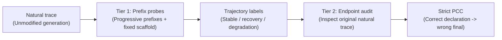

<div align="center">

# 🧠 Accuracy Dynamics and Rare Strict Post-Correctness Collapse
### *A Two-Tier Protocol for Small Reasoning Models*

[](https://www.python.org/)
[](https://pytorch.org/)
[](https://huggingface.co/)
[](https://developer.nvidia.com/cuda-zone)

**Is Post-Correctness Collapse a common failure mode, or an artifact of how we measure it?**

</div>

---

## 📌 Abstract

Prefix-based probes are widely used to study whether reasoning language models "think past the answer." However, a forced answer at an intermediate prefix is a counterfactual intervention, not evidence that the unmodified model naturally committed to that answer. 

We introduce a **two-tier protocol** that separates **Tier 1 forced-prefix correctness dynamics** from **Tier 2 strict post-correctness collapse (PCC)**. True strict PCC requires a model to organically declare a correct answer and subsequently replace it with an organically declared wrong final answer.

In this pilot study across DeepSeek-R1-Distill-Qwen-1.5B, Qwen2.5-3B-Instruct, and Llama-3.2-3B-Instruct, we find that prefix trajectories reveal a consistent tradeoff: **recovery is far more common than degradation.** While 56.7–75.0% of traces per run finish correct under forced probing after initial instability, only 3.3–10.0% satisfy forced-final degradation. A blind audit of all 11 forced-degradation candidates reveals only **one confirmed strict-PCC existence case**. 

> **Key Finding:** Strict PCC is rare relative to forced-prefix degradation. A first-correct oracle preserves 3.3–10.0 percentage points of Tier 1 accuracy, showing both the potential and danger of early stopping, because continuation usually repairs more than it damages.

---

## 🔬 Research Motivation & The Two-Tier Protocol

Prior studies suggest models often find the right answer, overthink, and then output the wrong answer. But does a forced intervention reflect natural behavior? 

To address this, we formalize **two evidence tiers**:

1. **Tier 1 (Forced-Prefix Trajectories):** Measures counterfactual answerability under a fixed stop-now intervention. We evaluate prefixes and assign labels: `STABLECORRECT`, `NEVERCORRECT`, `RECOVERY`, and `FORCEDDEGRADATION`.
2. **Tier 2 (Endpoint Audit):** Inspects the original natural trace and reserves `STRICTPCC` only for traces that organically declare the correct answer and later declare a wrong final answer.


```mermaid
flowchart LR
    NT["Natural trace<br/>(Unmodified generation)"] --> T1["Tier 1: Prefix probes<br/>(Progressive prefixes + fixed scaffold)"]
    T1 --> TL["Trajectory labels<br/>(Stable / recovery / degradation)"]
    TL --> T2["Tier 2: Endpoint audit<br/>(Inspect original natural trace)"]
    T2 --> SPCC["Strict PCC<br/>(Correct declaration -> wrong final)"]
```

---

## 📊 Key Empirical Results

### Tier 1 Outcomes: Recovery vastly outnumbers degradation

Across four runs (GSM8K and MATH-500), recovery/learning traces are far more common than forced-final degradation:

| Model / Benchmark | N | Natural correct | Stable | Recovery / learning | Forced degradation | Never correct |
|:---|:---:|:---:|:---:|:---:|:---:|:---:|
| **DeepSeek 1.5B / GSM8K** | 60 | 50 (83.3%) | 7 | 45 | 3 (5.0%) | 5 |
| **Qwen2.5 3B / GSM8K** | 60 | 49 (81.7%) | 11 | 37 | 2 (3.3%) | 10 |
| **Llama 3.2 3B / GSM8K** | 60 | 16 (26.7%) | 7 | 36 | 3 (5.0%) | 14 |
| **DeepSeek 1.5B / MATH-500** | 30 | 19 (63.3%) | 0 | 17 | 3 (10.0%) | 10 |

### Accuracy vs. Reasoning Budget (GSM8K, DeepSeek-R1-Distill-Qwen-1.5B)


> **Continuation Usually Repairs More Than It Damages:** A simple “stop as soon as the answer looks correct” rule is unsafe. Continued reasoning creates some harm, but it also repairs many more initially incorrect or unstable prefixes.

### Event-Aligned Flip Dynamics


*For more extensive results, data traces, and failure categorization logs, please browse the **[Full Results Folder](project/results/utkarsh_proper_run2_gsm8k/)**.*

### Tier 2 Audit: Strict PCC is Rare

When we blindly audited all 11 forced-degradation candidates across the entire dataset against their unmodified natural traces:
- **6** had no declared benchmark answer (Non-conclusion)
- **3** ended wrong without an organic correct declaration
- **1** remained naturally correct
- **Only 1** was a confirmed STRICT PCC case.

**Forced degradation is therefore best treated as a candidate-generation signal, not as a natural-PCC label.**

---

## 🔭 Exploratory Mechanistic Diagnostics

We explored whether scalar descriptors could provide a universal cross-model collapse signature:
- **Token Length & Hesitations:** Forced degradation candidates showed significantly higher token lengths and hesitation-marker ranks.
- **Null Results:** Entropy, top-two margin, distribution-shift score, and late-layer hidden-state velocity did *not* survive statistical correction.
- **Conclusion:** Secondary scalar diagnostics do not reveal a universal cross-model collapse signature, reinforcing the value of our two-tier semantic endpoint audit over relying on auxiliary variables.

---

## ⚙️ Tech Stack

| Layer | Technology |
|:---|:---|
| **Language** | Python 3.10+ |
| **ML Runtime** | PyTorch (CUDA-accelerated) |
| **Model Integration** | Hugging Face Transformers — `AutoModelForCausalLM`, `AutoTokenizer`, `model.generate` |
| **Quantization** | BitsAndBytes — 4-bit NF4 (QLoRA-compatible), 8-bit INT8 via `BitsAndBytesConfig` |
| **Visualization** | Matplotlib (publication-grade PNG + PDF), NumPy |
| **Benchmarks** | GSM8K (60-problem pilot) · MATH-500 (30-problem pilot) |

### Supported Models

| Model | HuggingFace ID | Size | VRAM (4-bit) |
|:---|:---|:---|:---|
| DeepSeek-R1-Distill-Qwen-1.5B | `deepseek-ai/DeepSeek-R1-Distill-Qwen-1.5B` | ~3.2 GB | ~2 GB |
| Qwen2.5-3B-Instruct | `Qwen/Qwen2.5-3B-Instruct` | ~6.5 GB | ~3.5 GB |
| Llama-3.2-3B-Instruct | `meta-llama/Llama-3.2-3B-Instruct` | ~6.5 GB | ~3.5 GB |

---

## 🗂️ Repository Structure

```text
LLM-Flip-Research/
├── README.md
├── datasets/
│   ├── raw/                        # Raw benchmark data
│   ├── processed/                  # Processed benchmark splits
│   ├── traces/                     # Sampled reasoning trace artifacts
│   ├── mechanistic/                # Per-token mechanistic metric data
│   └── analysis/                   # Aggregate analysis outputs
├── project/
    ├── run_pipeline.py             # End-to-end multi-stage pipeline orchestrator
    ├── download_model.py           # Model downloader & VRAM-aware manager
    ├── eval.py                     # Stage 1: Full-trace generation
    ├── difficulty.py               # Stage 2: Prefix slicing & budget forcing
    ├── evaluate_answers_standalone.py  # Stage 3: Output parsing & verification
    ├── plot_accuracy_curve.py      # Publication-grade accuracy curve plots
    ├── show_diagnosis.py           # CLI overthinking case study inspector
    ├── extract_variable_level_evidence.py   # Mechanistic descriptor analysis
    ├── modeling/                   # HF and backend wrappers
    ├── benchmarking/               # Benchmark dataset adapters (GSM8K, MATH-500)
    └── results/                    # Experiment outputs (auto-structured)
```

---

## 🚀 Getting Started

### 1. Clone & Set Up Environment

```bash
git clone https://github.com/utkarsh050505/LLM-Flip-Research.git
cd LLM-Flip-Research/project

python -m venv .venv
source .venv/bin/activate           # Linux / macOS
# .\\.venv\\Scripts\\Activate.ps1   # Windows PowerShell

pip install --upgrade pip
pip install -r requirements.txt
pip install matplotlib numpy huggingface_hub bitsandbytes accelerate
```

### 2. Configure Environment & Download Model

```bash
# Interactive menu: shows available models, sizes, and recommended VRAM
python download_model.py
```

### 3. Pipeline Usage

```bash
# Run the pipeline interactive picker
python run_pipeline.py

# Or run a quick CLI one-liner
python run_pipeline.py --model r1_distill_qwen1_5b --benchmark gsm8k --quantization none --granularity 15 --limit 10
```

---

## 📌 Paper Contributions

> **Title:** *Accuracy Dynamics and Rare Strict Post-Correctness Collapse: A Two-Tier Protocol for Small Reasoning Models*  
> **Authors:** Utkarsh Mandal, Abhigyan Shekhar, Parth Bhat, and Kartikey Agrawal (BMS College of Engineering, Bengaluru, India)

1. **Two-Tier Protocol:** A measurement protocol that separates forced-prefix answerability from natural-trace strict PCC, handling non-conclusion as a distinct endpoint.
2. **First-Correct Oracle Diagnostic:** Demonstrates that a first-correct oracle preserves 3.3–10.0 percentage points of Tier 1 accuracy.
3. **Blinded Two-Annotator Audit:** A semantic audit of 11 forced-degradation candidates yielding only one strict-PCC case, demonstrating that forced degradation is a candidate-generator, not a collapse label.
4. **Mechanistic Exploratory Analysis:** Found length and hesitation associations for forced degradation, but no universal scalar collapse threshold.

---

<div align="center">

*Interested in test-time compute, LLM reasoning, or mechanistic interpretability? Feel free to reach out!*

</div>
