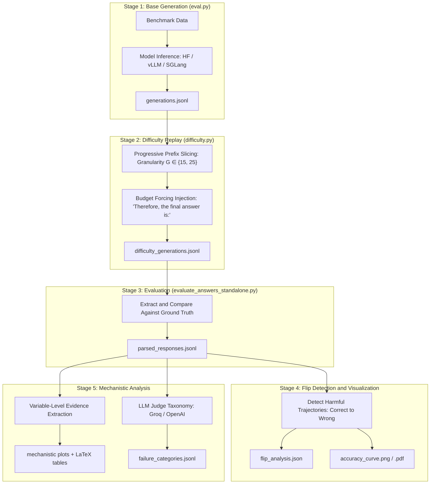
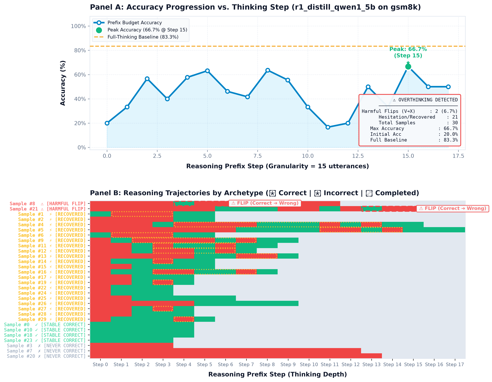
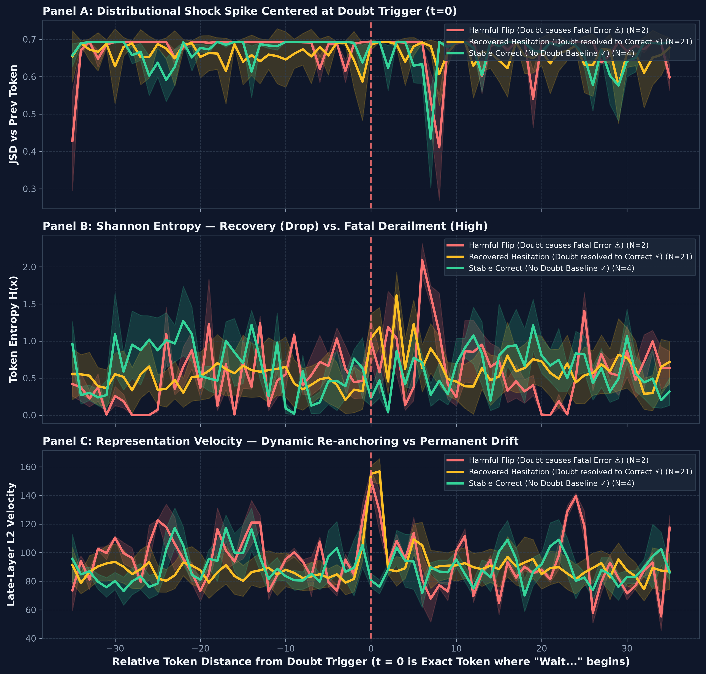

<div align="center">

# 🧠 Thinking Past the Answer
### *Empirical & Mechanistic Dynamics of Overthinking, Flip-Flops, and Hesitation in Reasoning LLMs*

[](https://www.python.org/)
[](https://pytorch.org/)
[](https://huggingface.co/)
[](https://developer.nvidia.com/cuda-zone)

**Can we detect — and stop — a reasoning model *before* it flips a correct answer to a wrong one?**

</div>

---

## 📌 Abstract

Modern Large Reasoning Models (LRMs) — such as **DeepSeek-R1**, **Qwen2.5-Math**, and **OpenAI o1/o3** — employ extended Chain-of-Thought (CoT) reasoning with test-time compute scaling to achieve state-of-the-art accuracy on complex mathematical and scientific benchmarks.

However, this research uncovers a systematic failure mode: **Post-Correctness Collapse (PCC)**, colloquially *"Thinking Past the Answer."* A model correctly solves a problem at an early intermediate reasoning stage — often within the first 20–40% of its thinking trace — then continues generating tokens, engages in uncalibrated second-guessing, and ultimately outputs an *incorrect* final answer.

This repository presents the first systematic **empirical and mechanistic characterization** of this phenomenon using:

- 📊 **Token-level probability distributions** (entropy, top-2 margin, Jensen–Shannon divergence)
- 🧬 **Layerwise residual stream geometry** (hidden-state L₂ velocity, cosine trajectory, PCA projections)
- 🔍 **Variable-level evidence extraction** across 7 mechanistic dimensions
- 🏷️ **A novel 6-archetype taxonomy** for reasoning trajectory classification
- 📉 **Latent accuracy curves** via prefix-truncation and budget-forcing protocols

> **Key Finding:** Peak accuracy occurs significantly *before* the final token. Forcing an answer at 25–40% of the reasoning budget can outperform full-trace completion — meaning more thinking actively *hurts*.

---

## 🔬 Research Motivation

```
[Problem Prompt] ──▶ Step 1: Exploration ──▶ ... ──▶ Step k: ✅ CORRECT ANSWER FOUND
                                                              │
                                    (Overthinking begins)    │
                                                              ▼
                                              Step N: ❌ FINAL ANSWER IS WRONG
```

This failure mode has three root manifestations:

| Pathology | Description |
|:---|:---|
| **Harmful Flips (Strict PCC)** | Model finds the correct answer early, then loses confidence, re-derives incorrectly, and submits the wrong answer |
| **Hesitation & Recovery** | Model oscillates between candidate answers mid-trace, but recovers via self-correction before the final output |
| **Termination Suppression** | Model reaches the correct answer internally but lacks sufficient `P(EOS)` / `P(</think>)` probability to exit the reasoning loop |

Understanding and predicting these failure modes enables the design of **adaptive test-time compute controllers** that stop reasoning at the optimal moment — preventing overthinking while preserving beneficial self-correction.

---

## 🏛️ System Architecture

The pipeline is organized into 5 sequential, modular stages:


```mermaid
flowchart TD
    subgraph S1["Stage 1: Base Generation (eval.py)"]
        D1[Benchmark Data] --> M1["Model Inference: HF / vLLM / SGLang"]
        M1 --> G1[generations.jsonl]
    end

    subgraph S2["Stage 2: Difficulty Replay (difficulty.py)"]
        G1 --> P1["Progressive Prefix Slicing: Granularity G ∈ {15, 25}"]
        P1 --> F1["Budget Forcing Injection: 'Therefore, the final answer is:'"]
        F1 --> DG[difficulty_generations.jsonl]
    end

    subgraph S3["Stage 3: Evaluation (evaluate_answers_standalone.py)"]
        DG --> EV[Extract and Compare Against Ground Truth]
        EV --> PR[parsed_responses.jsonl]
    end

    subgraph S4["Stage 4: Flip Detection and Visualization"]
        PR --> FD["Detect Harmful Trajectories: Correct to Wrong"]
        FD --> JSON_FA[flip_analysis.json]
        FD --> PLOT["accuracy_curve.png / .pdf"]
    end

    subgraph S5["Stage 5: Mechanistic Analysis"]
        PR --> ME[Variable-Level Evidence Extraction]
        ME --> VIZ["mechanistic plots + LaTeX tables"]
        PR --> JUDGE["LLM Judge Taxonomy: Groq / OpenAI"]
        JUDGE --> TAX[failure_categories.jsonl]
    end
```

---

## 📐 The 6-Archetype Reasoning Taxonomy

Every reasoning trajectory is classified into one of six scientifically-defined outcome archetypes:

| # | Archetype | Description | Key Signal |
|:--|:---|:---|:---|
| 1 | **`STABLE_CORRECT`** | Early correct convergence, maintained confidence, clean termination | H ≈ 0.47, P(Term) ≈ 0.047 |
| 2 | **`PREFIX_VOLATILE_RECOVERY`** | Constructive hesitation — oscillates but self-corrects before final answer | H ≈ 0.54, elevated hesitations |
| 3 | **`STRICT_PCC`** ⚠️ | *Harmful flip* — correct early, collapses to wrong at final output | H ≈ 0.53, low P(Term) ≈ 0.019 |
| 4 | **`NO_FINAL_AFTER_CORRECT`** | Model holds correct reasoning but never produces `\boxed{}` before token budget expires | Very low P(Term) |
| 5 | **`DEGENERATE`** | Circular reasoning loops; disfluent repetitions dominate | rep ≥ 35%, hesitations ≥ 35, P(Term) ≈ 0.007 |
| 6 | **`NEVER_CORRECT`** | Model never reaches the correct reasoning branch from start to finish | — |

---

## 📊 Key Empirical Results

### Accuracy vs. Reasoning Budget (GSM8K, DeepSeek-R1-Distill-Qwen-1.5B)



> **The model's latent accuracy *peaks early*, often at 25–40% of its reasoning trace, before collapsing as it over-deliberates.**

| Outcome Archetype | Avg. Tokens | Entropy H ↓ | Top-2 Margin ↑ | Late L₂ Velocity | P(Term) ↑ | Hesitations | 4-gram Repetition |
|:---|:---:|:---:|:---:|:---:|:---:|:---:|:---:|
| **Stable Correct** | 778 | **0.472** | **0.765** | 423.8 | **0.0469** | **3.0** | **4.3%** |
| **Volatile Recovery** | 1,908 | 0.543 | 0.736 | 410.2 | 0.0137 | 9.8 | 15.4% |
| **Harmful Flips (PCC)** | 1,719 | 0.531 | 0.741 | 412.5 | 0.0192 | 8.7 | 13.5% |
| **Degenerate (Loops)** | 3,928 | 0.657 | 0.688 | 402.1 | 0.0067 | 51.5 | 41.2% |
| **Never Correct** | 2,502 | 0.630 | 0.704 | 407.1 | 0.0085 | 18.5 | 22.1% |

**Interpretation:** Stable correct trajectories are characterized by decisively lower entropy, higher token commitment margins, and stronger termination pressure — all measurable *before* the answer is submitted.

### Event-Aligned Flip Dynamics



Centering analysis on the precise flip token (t = 0, window [−200, +200]):

- 📈 **Entropy spikes ~50 tokens *prior* to the harmful flip** — a predictable early-warning signal
- 📉 **Top-2 margin collapses** as the model loses single-token commitment
- 🚀 **Late-layer L₂ velocity surges** — the residual stream undergoes sudden geometric disruption (representation shock)

*For more extensive results, data traces, and failure categorization logs, please browse the **[Full Results Folder](project/results/utkarsh_proper_run2_gsm8k/)**.*

---

## 🔭 Mechanistic Metrics Framework

### A. Token-Level Uncertainty (Distribution Dynamics)

| Metric | Formula | Interpretation |
|:---|:---|:---|
| **Shannon Entropy** | H(x) = −∑ pᵢ log pᵢ | Lower → sharper, more confident prediction |
| **Top-2 Margin** | p₍₁₎ − p₍₂₎ | Higher → stronger single-answer commitment |
| **JSD Shock** | JS-Divergence(t, t−1) | Spikes → abrupt cognitive disruption / doubt onset |

### B. Hidden-State Geometry (Residual Stream Dynamics)

| Metric | Formula | Interpretation |
|:---|:---|:---|
| **Late-Layer L₂ Velocity** | ‖h_t^(L) − h_{t-1}^(L)‖₂ | Euclidean speed of semantic drift at final layers |
| **Directional Cosine Similarity** | cos(Δh_t, Δh_{t-1}) | Low/negative → the model is disoriented, zigzagging |
| **PCA Trajectory** | 2D projection of h_t sequence | Visual map of the reasoning path geometry |

### C. Termination & Disfluency Signals

| Metric | Description |
|:---|:---|
| **P(Term) / P(EOS) / P(\</think\>)** | Direct softmax probability assigned to stopping tokens — the model's "desire to stop" |
| **Hesitation Count** | Frequency of disfluency markers: *"Wait", "Let me check", "Actually", "Mistake", "Hold on"* |
| **4-Gram Repetition Ratio** | Fraction of repeated 4-token sequences — measures circular/degenerate reasoning |

### D. Variable-Level Evidence Engine (7 Dimensions)

The [`extract_variable_level_evidence.py`](project/extract_variable_level_evidence.py) engine extracts the full mechanistic evidence profile per sample:

1. **Termination Pressure** — eos_prob, eos_rank, think_close_prob, think_close_rank, boxed_prob
2. **Distribution Instability** — entropy, top-2 margin, JSD vs. previous step
3. **Hidden-State Geometry** — L₂ and cosine at early / mid / late layers + loop score
4. **Forced-Budget Deltas** — Δentropy, Δtop-2, ΔJSD, ΔL₂, Δtermination
5. **Answer Belief / Margin** — Ground-truth token probability vs. competitor candidates
6. **Textual Degeneration** — Repetition ratio, disfluency counts, post-correct token length
7. **Outcome-Aligned Group Comparison** — All 6 archetypes compared side-by-side

**Outputs:** `variable_level_mechanisms.png/.pdf`, `variable_level_summary.csv`, `variable_level_metrics.json`, `variable_level_latex_table.tex`

---

## ⚙️ Tech Stack

| Layer | Technology |
|:---|:---|
| **Language** | Python 3.10+ |
| **ML Runtime** | PyTorch (CUDA-accelerated) |
| **Model Integration** | Hugging Face Transformers — `AutoModelForCausalLM`, `AutoTokenizer`, `model.generate` |
| **Quantization** | BitsAndBytes — 4-bit NF4 (QLoRA-compatible), 8-bit INT8 via `BitsAndBytesConfig` |
| **Inference Backends** | HF Transformers · vLLM · SGLang · Multi-GPU DDP |
| **Visualization** | Matplotlib (publication-grade PNG + PDF), NumPy |
| **Taxonomy / LLM Judge** | Groq API (Llama-3.3-70B) / OpenAI GPT-4o |
| **Benchmarks** | GSM8K · MATH-500 · AIME 2025 · GPQA · MathVista · AI2D · MMStar · MathVerse · VMCBench |
| **Analysis** | PyTorch forward-pass hooks for exact logit + hidden-state extraction |

### Supported Models

| Model | HuggingFace ID | Size | VRAM (4-bit) |
|:---|:---|:---|:---|
| DeepSeek-R1-Distill-Qwen-1.5B | `deepseek-ai/DeepSeek-R1-Distill-Qwen-1.5B` | ~3.2 GB | ~2 GB |
| DeepSeek-R1-Distill-Qwen-7B | `deepseek-ai/DeepSeek-R1-Distill-Qwen-7B` | ~15.0 GB | ~5 GB |
| DeepSeek-R1-Distill-Llama-8B | `deepseek-ai/DeepSeek-R1-Distill-Llama-8B` | ~16.0 GB | ~6 GB |
| Qwen2.5-1.5B/3B/7B-Instruct | `Qwen/Qwen2.5-{1.5,3,7}B-Instruct` | 3–15 GB | 2–6 GB |
| Qwen2.5-VL-7B (Vision-Language) | `Qwen/Qwen2.5-VL-7B-Instruct` | ~16 GB | ~6 GB |
| Qwen3-8B / Qwen3.5-9B | `Qwen/Qwen3-8B`, `Qwen/Qwen3.5-9B` | ~16–18 GB | ~6–7 GB |

---

## 🗂️ Repository Structure

```text
LLM-Flip-Research/
├── README.md
├── .gitignore
│
├── datasets/
│   ├── raw/                        # Raw benchmark data
│   ├── processed/                  # Processed benchmark splits
│   ├── traces/                     # Sampled reasoning trace artifacts
│   ├── mechanistic/                # Per-token mechanistic metric data
│   └── analysis/                   # Aggregate analysis outputs
│
├── docs/
│   └── pcc_branch_runner_walkthrough.md   # Detailed PCC branching guide
│
└── project/
    ├── run_pipeline.py             # End-to-end multi-stage pipeline orchestrator
    ├── download_model.py           # Model downloader & VRAM-aware manager
    ├── eval.py                     # Stage 1: Full-trace generation
    ├── difficulty.py               # Stage 2: Prefix slicing & budget forcing
    ├── evaluate_answers_standalone.py  # Stage 3: Output parsing & verification
    ├── plot_accuracy_curve.py      # Publication-grade accuracy curve plots
    ├── show_diagnosis.py           # CLI overthinking case study inspector
    ├── extract_variable_level_evidence.py   # 7-dimension mechanistic analysis
    ├── extract_real_mechanistic_metrics.py  # Real forward-pass metric extraction
    ├── plot_mechanistic_analysis.py         # Mechanistic figure generation
    ├── plot_scientific_mechanistic_insights.py  # Scientific insight visualizations
    ├── find_exact_doubt_token.py   # Pinpoint the precise doubt-onset token
    ├── context.md                  # Research paper context & metrics glossary
    ├── requirements.txt            # Python dependencies
    │
    ├── modeling/                   # Model backend wrappers
    │   └── hf_model.py             # HuggingFace backend (quantization, stepping, KV-cache)
    │
    ├── benchmarking/               # Benchmark dataset adapters
    │   ├── gsm8k.py                # GSM8K: Grade school math
    │   ├── math500.py              # MATH-500: Competition math
    │   ├── aime2025.py             # AIME 2025: High-school olympiad
    │   ├── gpqa.py                 # GPQA: Graduate-level science MCQs
    │   ├── mathvista.py            # MathVista: Multimodal math
    │   ├── ai2d.py                 # AI2D: Science diagrams
    │   ├── mmstar.py               # MMStar: Multimodal benchmark
    │   └── ...                     # + MathVerse, MathVision, VMCBench
    │
    ├── evaluation/                 # Answer parsing, boxed extraction, normalization
    ├── taxonomy/                   # LLM-Judge failure classification
    ├── utils/                      # Logging, DDP, seeds, experiment path helpers
    │
    └── results/                    # Experiment outputs (auto-structured)
        └── main/
            └── [model_name]/
                └── [benchmark]/
                    └── seed_[seed]/
                        └── budget_prompt_[label]/
                            ├── generations.jsonl
                            ├── difficulty_generations.jsonl
                            ├── parsed_responses_*.jsonl
                            ├── flip_analysis.json
                            ├── flip_curve.csv
                            ├── accuracy_curve.png
                            ├── accuracy_curve.pdf
                            └── *_failure_categories.jsonl
```

---

## 🚀 Getting Started

### Prerequisites

- Python 3.10 or 3.11
- NVIDIA GPU with CUDA support (≥4 GB VRAM for 1.5B; ≥6 GB for 7B–8B models with 4-bit quantization)
- Git

### 1. Clone & Set Up Environment

```bash
git clone https://github.com/utkarsh050505/LLM-Flip-Research.git
cd LLM-Flip-Research/project

# Create and activate virtual environment
python -m venv .venv
source .venv/bin/activate           # Linux / macOS
# .\\.venv\\Scripts\\Activate.ps1   # Windows PowerShell

# Install dependencies
pip install --upgrade pip
pip install -r requirements.txt
pip install matplotlib numpy huggingface_hub bitsandbytes accelerate
```

### 2. Configure Environment

```powershell
# Set Hugging Face model cache directory
$env:HF_HOME = "A:\LLMResearch\hf_cache"

# Set LLM Judge API key for taxonomy classification (Stage 5)
# Free tier available at https://console.groq.com
$env:GROQ_API_KEY = "your_groq_api_key_here"
```

### 3. Download a Model

```bash
# Interactive menu: shows available models, sizes, and recommended VRAM
python download_model.py

# Or specify directly (fastest for experimentation)
python download_model.py --model r1_distill_qwen1_5b

# Download and immediately verify GPU loading
python download_model.py --model r1_distill_qwen1_5b --test_load

# List all models already on disk
python download_model.py --list
```

---

## 🔁 Pipeline Usage

All commands are run from the `project/` directory.

### Interactive Mode (Recommended)

```bash
python run_pipeline.py
```

> Scans local HuggingFace cache, presents an interactive model picker, prompts for quantization (4-bit, 8-bit, full), and runs all 5 stages automatically.

### CLI One-Liner (Quick 10-sample test)

```bash
python run_pipeline.py \
  --model r1_distill_qwen1_5b \
  --benchmark gsm8k \
  --quantization none \
  --granularity 25 \
  --limit 10
```

### Large Model with 4-bit Quantization

```bash
python run_pipeline.py \
  --model r1_distill_llama8b \
  --benchmark gsm8k \
  --quantization 4bit \
  --granularity 10 \
  --limit 50
```

### Key CLI Flags

| Flag | Description |
|:---|:---|
| `--limit N` | Run on only N benchmark samples for rapid prototyping |
| `--granularity K` | Slice reasoning trace every K utterances (default: 1; use 25 for speed) |
| `--budget_forcing_prompt "..."` | Custom answer-forcing injection phrase |
| `--skip_eval / --skip_difficulty / --skip_taxonomy` | Resume from cached intermediate stages |
| `--judge_provider groq / openai` | LLM Judge provider for failure taxonomy (Stage 5) |

---

## 📈 Visualization & Analysis

### Generate Accuracy Curves

```bash
# Auto-detects latest experiment run
python plot_accuracy_curve.py

# Or specify a target directory explicitly
python plot_accuracy_curve.py \
  --input results/main/r1_distill_qwen1_5b/gsm8k/seed_42/budget_prompt_Therefore__the_final_answer_is
```

**Outputs:**
- 🖼️ `accuracy_curve.png` — Dual-panel publication-quality visualization
- 📄 `accuracy_curve.pdf` — Vector format for paper inclusion

**The dual-panel layout shows:**
1. **Top panel:** Empirical accuracy (%) vs. intermediate prefix budget (0% → 100%)
2. **Bottom panel:** Individual question trajectories — `✅ Correct → ❌ Flipped` and `✅ → ❌ → ✅ Recovered`

### Run Mechanistic Analysis

```bash
# Extract 7-dimension variable-level mechanistic evidence
python extract_variable_level_evidence.py \
  --run_dir results/main/r1_distill_qwen1_5b/gsm8k/seed_42/budget_prompt_Therefore__the_final_answer_is \
  --model deepseek-ai/DeepSeek-R1-Distill-Qwen-1.5B \
  --quantization 4bit

# Extract real forward-pass token-level metrics
python extract_real_mechanistic_metrics.py \
  --run_dir results/main/r1_distill_qwen1_5b/gsm8k/seed_42/budget_prompt_Therefore__the_final_answer_is \
  --model deepseek-ai/DeepSeek-R1-Distill-Qwen-1.5B \
  --quantization 4bit
```

### Inspect Failure Case Studies (CLI Viewer)

```bash
python show_diagnosis.py
```

Example output:
```
================================================================================
  OVERTHINKING TAXONOMY DIAGNOSIS REPORT
================================================================================
  [1/2] Sample #8 (Question Index 8)
------------------------------------------------------------------------
  Question:       John drives for 3 hours at 60 mph and turns around... How far is he from home?
  Ground Truth:   45
  Earlier (Step 4): Answer was CORRECT -> 45
  Final   (Step 7): Answer FLIPPED TO WRONG -> 2

  [CATEGORY] Primary:    LOGICAL_ERROR
  [WHY IT FAILED]        The model became confused by time constraints and
                         entered circular second-guessing.
  [QUOTE FROM TRACE]     "But the problem says he spends the first 2 hours in
                         traffic, so perhaps he can't do that."
```

---

## 🧪 Benchmarks Evaluated

| Benchmark | Domain | Difficulty | Samples |
|:---|:---|:---|:---|
| **GSM8K** | Grade school arithmetic & multi-step word problems | Elementary | 1,319 |
| **MATH-500** | Competition math (algebra, geometry, calculus, number theory) | Advanced | 500 |
| **AIME 2025** | High-school olympiad (AMC 10/12) | Expert | ~30 |
| **GPQA** | Graduate-level physics, chemistry, biology MCQs | PhD-level | 448 |
| **MathVista** | Multimodal math reasoning (charts, geometry figures) | Advanced | 1,000 |
| **AI2D** | Science diagram understanding | Middle school | 4,563 |
| **MMStar** | Multi-category multimodal reasoning | Advanced | 1,500 |
| **MathVerse / MathVision / VMCBench** | Visual mathematical reasoning | Expert | varied |

---

## 🛣️ Research Roadmap

| Priority | Research Direction | Status |
|:---|:---|:---:|
| **1** | **Hazard Predictor / Early-Exit Controller** — Classify internal signals (entropy, margin, cosine) to trigger early stopping *before* flip collapse | 🟡 In Progress |
| **2** | **High-Hardness Benchmark Scaling** — Measure PCC flip rates on MATH-500, AIME 2025, and GPQA | 🟡 In Progress |
| **3** | **Model Comparison Matrix** — DeepSeek-R1-Distill (Qwen vs. Llama) vs. Qwen2.5/Qwen3 family | 🟢 Ready |
| **4** | **Granularity Optimization** — Token-level vs. utterance-level resolution for flip-token localization | 🟢 Ready |
| **5** | **Multimodal Overthinking** — Qwen2.5-VL on MathVista: visual hallucination-induced flips | 🟡 In Progress |

---

## 📌 Paper Contributions

> **Title:** *Thinking Past the Answer: Empirical & Mechanistic Dynamics of Overthinking, Flip-Flops, and Hesitation in Reasoning LLMs*

1. **Novel Phenomenon Characterization:** First systematic study of Post-Correctness Collapse (PCC) in large reasoning models — defining, measuring, and categorizing the six reasoning outcome archetypes.

2. **Mechanistic Interpretability:** Demonstration that harmful flips are mechanistically preceded by measurable signals (entropy spikes, L₂ velocity surges, margin collapse) detectable ~50 tokens *before* the flip occurs.

3. **Latent Accuracy Protocol:** A new experimental protocol (prefix truncation + budget forcing) for constructing ground-truth latent accuracy curves over reasoning time — revealing that peak accuracy occurs significantly before trace completion.

4. **Reproducible Failure Taxonomy:** A structured, LLM-judge-backed taxonomy for categorizing *why* a model flips: `LOGICAL_ERROR`, `CALCULATION_ERROR`, `DEGENERATE_REPETITION`, and more.

5. **Foundation for Adaptive Controllers:** Identification of the precise mechanistic signals that future hazard predictors and early-exit controllers can use to prevent overthinking without sacrificing beneficial self-correction.

---

## 🤝 Contributing & Contact

This is an active research project. Contributions and collaborations are welcome — especially in:

- 🔮 **Hazard predictor / early-exit controller** design and training
- 📦 **New benchmark adapters** for additional reasoning domains
- 🖼️ **Multimodal extension** (visual reasoning overthinking)
- 🧪 **Model comparison experiments** across reasoning model families

Open a GitHub issue for bugs, experiments, or methodology questions. See [`project/context.md`](project/context.md) for the complete mechanistic framework and metrics glossary.

---

<div align="center">

*Interested in test-time compute, LLM reasoning, or mechanistic interpretability? Feel free to reach out!*

</div>
