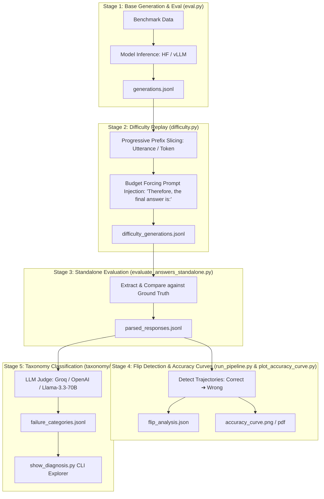

# 🧠 LLM-Flip-Research: "Thinking Past the Answer"
### Comprehensive Teammate Onboarding, Running Guide & Research Overview

---

## 1. 🎯 Research Vision & Core Concepts

### The Problem: Post-Correctness Collapse (PCC) & Overthinking
Large Reasoning Models (LRMs) such as **DeepSeek-R1**, **Qwen-2.5-Math**, and **Qwen-3/3.5** generate extensive Chain-of-Thought (CoT) reasoning traces before providing a final answer. While more thinking generally improves accuracy, it often leads to **Post-Correctness Collapse (PCC)** or **Overthinking Flips**:
> **A model arrives at the correct intermediate solution during its internal reasoning, continues deliberating, second-guesses itself or enters a degenerative loop, and ultimately outputs an *incorrect* final answer.**

```
[Prompt] ──▶ Step 1: Initial exploration ──▶ Step k: [CORRECT SOLUTION FOUND] ✓
                                                           │
               (Harmful Overthinking / Second-Guessing)   │
                                                           ▼
                                             Step N: [FINAL FLIPPED TO WRONG] ✗
```

### Core Research Questions
1. **At what point during reasoning does accuracy peak?** (Constructing the reasoning budget vs. accuracy curve).
2. **Why does the model flip?** (Classifying root causes: arithmetic errors, visual hallucinations, degenerative loops, circular logic, prompt misinterpretations).
3. **Can we predict and stop before the flip?** (Using internal hidden states, token entropy, top-2 probability margins, and uncertainty indicators to build an automatic early-stopping controller / hazard predictor).

---

## 2. 🏛️ System Architecture & Key Capabilities



### Core Features

| Feature | Description | Key Modules |
| :--- | :--- | :--- |
| **Interactive Pipeline Orchestrator** | 1-click end-to-end pipeline with cache scanning, model detection, quantization selection, and stage skip options. | [`run_pipeline.py`](file:///a:/LLMResearch/project/run_pipeline.py) |
| **Model Downloader & Manager** | Fast multi-threaded Hugging Face downloads to local cache with VRAM estimation and smoke-load tests. | [`download_model.py`](file:///a:/LLMResearch/project/download_model.py) |
| **Quantization Support** | Native 4-bit NF4 and 8-bit quantization via `bitsandbytes` to run 7B–9B models locally on modest GPUs (4GB–8GB VRAM). | [`modeling/hf_model.py`](file:///a:/LLMResearch/project/modeling/hf_model.py) |
| **Multi-Engine Inference** | Supports standard Hugging Face `transformers`, high-throughput `vLLM`, `sglang`, and multi-GPU `ddp`. | [`modeling/`](file:///a:/LLMResearch/project/modeling) |
| **Extensive Benchmark Suite** | Adapters for math, reasoning, and multimodal benchmarks (GSM8K, MATH500, AIME2025, GPQA, MathVista, AI2D, MMStar, etc.). | [`benchmarking/`](file:///a:/LLMResearch/project/benchmarking) |
| **Accuracy Curve & Flip Visualization** | Generates publication-ready dual-panel plots showing accuracy progression across thinking budgets and flip summary cards. | [`plot_accuracy_curve.py`](file:///a:/LLMResearch/project/plot_accuracy_curve.py) |
| **Automated Failure Taxonomy** | Compares last-correct prefix traces against final failed traces using LLM judges to label root causes. | [`taxonomy/`](file:///a:/LLMResearch/project/taxonomy) |
| **Diagnosis Inspector** | Terminal-based inspection tool to browse overthinking case studies with exact reasoning snippets. | [`show_diagnosis.py`](file:///a:/LLMResearch/project/show_diagnosis.py) |

---

## 3. 🛠️ Environment Setup & Installation

### Prerequisites
- Python 3.10 or 3.11
- NVIDIA GPU with CUDA support
- Git

### 1. Clone & Create Virtual Environment
```bash
git clone https://github.com/utkarsh050505/LLM-Flip-Research.git
cd LLM-Flip-Research/project

# Create virtual environment
python -m venv .venv

# Activate environment (Windows PowerShell)
.\.venv\Scripts\Activate.ps1

# Activate environment (Linux/macOS)
# source .venv/bin/activate
```

### 2. Install Dependencies
```bash
python -m pip install --upgrade pip
pip install -r requirements.txt
pip install matplotlib numpy huggingface_hub bitsandbytes accelerate
```

### 3. Set Environment Variables
```powershell
# Optional: Set custom Hugging Face cache directory (default is A:\LLMResearch\hf_cache)
$env:HF_HOME = "A:\LLMResearch\hf_cache"

# Set your Groq API key for Stage 5 LLM Judge taxonomy classification (Free tier at console.groq.com)
$env:GROQ_API_KEY = "your_groq_api_key_here"
```

---

## 4. 🚀 How to Run: Step-by-Step Guide

All commands below should be executed from the `project/` directory (`cd project`).

```
a:\LLMResearch\project>
```

---

### Step 1: Download and Verify a Model
Use [`download_model.py`](file:///a:/LLMResearch/project/download_model.py) to download models directly into the project cache:

```bash
# 1. Interactive menu (shows available models, sizes, and recommended VRAM)
python download_model.py

# 2. Download a specific model (e.g. DeepSeek-R1-Distill-Qwen-1.5B)
python download_model.py --model r1_distill_qwen1_5b

# 3. Download and test loading into GPU memory
python download_model.py --model r1_distill_qwen1_5b --test_load

# 4. List all locally cached models on disk
python download_model.py --list
```

**Supported Models Catalog:**
- `r1_distill_qwen1_5b` (`deepseek-ai/DeepSeek-R1-Distill-Qwen-1.5B` ~3.2 GB) — *Fastest for rapid testing*
- `r1_distill_qwen7b` (`deepseek-ai/DeepSeek-R1-Distill-Qwen-7B` ~15.0 GB)
- `r1_distill_llama8b` (`deepseek-ai/DeepSeek-R1-Distill-Llama-8B` ~16.0 GB)
- `qwen2_5_1_5b` / `qwen2_5_3b` / `qwen2_5_7b`
- `qwen2_5vl` (Vision-Language)
- `qwen3` / `qwen3_5`

---

### Step 2: Run the End-to-End Pipeline
[`run_pipeline.py`](file:///a:/LLMResearch/project/run_pipeline.py) orchestrates all 5 stages in sequence:

#### Option A: Interactive Mode (Recommended for newcomers)
```bash
python run_pipeline.py
```
> Scans your cache, presents an interactive picker for downloaded models, prompts for quantization (4-bit, 8-bit, or Full Precision), and runs the pipeline.

#### Option B: CLI One-Liner (Quick test on 10 samples)
```bash
python run_pipeline.py \
  --model r1_distill_qwen1_5b \
  --benchmark gsm8k \
  --quantization none \
  --granularity 25 \
  --limit 10
```

#### Option C: Running Larger Models with 4-bit Quantization
```bash
python run_pipeline.py \
  --model r1_distill_llama8b \
  --benchmark gsm8k \
  --quantization 4bit \
  --granularity 10 \
  --limit 50
```

#### Useful CLI Flags:
- `--limit N`: Run on only $N$ benchmark samples for quick experimentation.
- `--granularity K`: Slice reasoning trace every $K$ utterances (default: 1; use 10 or 25 for faster multi-prefix generation).
- `--budget_forcing_prompt "..."`: Custom phrase injected to prompt the model for immediate answer.
- `--skip_eval` / `--skip_difficulty` / `--skip_taxonomy`: Skip earlier stages if their output files already exist.
- `--judge_provider groq` / `openai`: Provider for Stage 5 taxonomy classification.

---

### Step 3: Visualize Accuracy Curves & Flips
[`plot_accuracy_curve.py`](file:///a:/LLMResearch/project/plot_accuracy_curve.py) generates publication-grade graphs:

```bash
# Auto-detects the latest experiment run in results/
python plot_accuracy_curve.py

# Or specify a target experiment folder:
python plot_accuracy_curve.py --input results/main/r1_distill_qwen1_5b/gsm8k/seed_42/budget_prompt_Therefore__the_final_answer_is
```

Outputs:
- 🖼️ `accuracy_curve.png` (High-res visualization)
- 📄 `accuracy_curve.pdf` (Vector format for papers)

---

### Step 4: Inspect Overthinking Diagnoses (CLI Viewer)
[`show_diagnosis.py`](file:///a:/LLMResearch/project/show_diagnosis.py) displays the LLM Judge diagnoses for cases where the model flipped:

```bash
# Auto-detects the latest failure categories file
python show_diagnosis.py

# Or specify a specific categories file
python show_diagnosis.py results/main/r1_distill_qwen1_5b/gsm8k/seed_42/budget_prompt_Therefore__the_final_answer_is/parsed_responses_difficulty_difficulty_utterance_granularity_25_last_true_failure_categories.jsonl
```

**Example Diagnosis Output:**
```text
================================================================================
  OVERTHINKING TAXONOMY DIAGNOSIS REPORT
================================================================================
  [1/2] Sample #8 (Question Index 8)
--------------------------------------------------------------------------------
  Question:       John drives for 3 hours at 60 mph and turns around... How far is he from home?
  Ground Truth:   45
  Earlier (Step 4): Answer was CORRECT -> 45
  Final   (Step 7): Answer FLIPPED TO WRONG -> 2

  [CATEGORY] Primary:      LOGICAL_ERROR
  [WHY IT FAILED]          The model became confused by time constraints and entered circular second-guessing.
  [KEY EVIDENCE]           "He tries to get home in 4 hours, but he can only spend 1 hour in traffic..."
  [QUOTE FROM TRACE]       "But the problem says he spends the first 2 hours in traffic, so perhaps he can't do that."
```

---

## 5. 📁 Directory & Results Structure

```text
a:\LLMResearch\
├── start.md                        # Root onboarding guide
├── hf_cache/                       # Local Hugging Face models cache (HF_HOME)
├── When-More-Thinking-Hurts.pdf    # Core reference paper on overthinking
└── project/
    ├── start.md                    # Project-level onboarding guide
    ├── download_model.py           # Model downloader & manager
    ├── run_pipeline.py             # End-to-end multi-stage pipeline orchestrator
    ├── plot_accuracy_curve.py      # Publication-grade plotting script
    ├── show_diagnosis.py           # Overthinking failure diagnosis CLI inspector
    ├── eval.py                     # Stage 1: Initial evaluation & trace generation
    ├── difficulty.py               # Stage 2: Prefix continuation & budget forcing
    ├── evaluate_answers_standalone.py # Stage 3: Output parsing & verification
    │
    ├── modeling/                   # Model wrappers (HF, vLLM, SGLang, Qwen, R1)
    ├── benchmarking/               # Benchmark adapters (GSM8K, MATH500, MathVista, etc.)
    ├── evaluation/                 # Answer parsing, boxed extraction, normalization
    ├── taxonomy/                   # LLM Judge classification & category summarizers
    ├── utils/                      # Logging, DDP, seeds, experiment path helpers
    │
    └── results/                    # Experiment runs output folder
        └── main/
            └── [model_name]/
                └── [benchmark]/
                    └── seed_[seed]/
                        └── budget_prompt_[label]/
                            ├── generations.jsonl
                            ├── difficulty_generations.jsonl
                            ├── parsed_responses_...jsonl
                            ├── flip_analysis.json
                            ├── flip_curve.csv
                            ├── accuracy_curve.png
                            ├── accuracy_curve.pdf
                            └── *_failure_categories.jsonl
```

---

## 6. 🔬 Current Work & Ongoing Research

### 1. Empirical Findings on GSM8K (DeepSeek-R1-Distill-Qwen-1.5B)
- **Early Prefix Accuracy**: Models often discover the ground truth within the first 2–4 reasoning steps (accuracy spikes to 50%+).
- **Over-deliberation Valley**: During intermediate steps (steps 5–8), accuracy dips significantly (dropping to 0–20%) as the model generates redundant verifications, questions its own assumptions, and encounters imaginary contradictions.
- **Observed Failure Modes**:
  - `logical_error`: Second-guessing valid equations due to misunderstood problem constraints.
  - `calculation_error`: Minor arithmetic slip introduced during re-computation of already solved terms.
  - `degenerate_repetition`: Repeating reasoning loops until generation budget expires.

### 2. Active Research & Engineering Priorities

| Priority | Objective | Owner / Status |
| :--- | :--- | :--- |
| **1. Hazard Predictor / Early-Exit Controller** | Develop a classifier based on internal metrics (token entropy, top-2 probability margin, hidden-state cosine distance) that triggers an early stopping token *before* the model enters a flip collapse. | 🟡 In Progress |
| **2. High-Hardness Benchmark Scaling** | Run evaluations on **MATH500**, **AIME 2025**, and **GPQA** to measure flip rates on problems requiring deep multi-step proofs. | 🟡 In Progress |
| **3. Model Comparison Matrix** | Compare flip tendencies across model families: DeepSeek-R1 distilled (Qwen vs. Llama) vs. Native Qwen2.5/Qwen3. | 🟢 Ready to run |
| **4. Granularity Optimization** | Benchmark utterance-level vs. token-level granularity for high-resolution detection of the exact "flip token". | 🟢 Ready to run |
| **5. Multimodal Overthinking** | Evaluate **Qwen2.5-VL** on **MathVista** to analyze visual hallucination flips. | 🟡 In Progress |

---

## 7. 💡 Quick Cheat Sheet for Teammates

| Task | Command |
| :--- | :--- |
| **Download 1.5B model** | `python download_model.py --model r1_distill_qwen1_5b` |
| **Download 8B model** | `python download_model.py --model r1_distill_llama8b` |
| **Run full pipeline (quick 10-sample run)** | `python run_pipeline.py --model r1_distill_qwen1_5b --benchmark gsm8k --limit 10` |
| **Run on 8B model with 4-bit quantization** | `python run_pipeline.py --model r1_distill_llama8b --benchmark gsm8k --quantization 4bit --limit 20` |
| **Generate plot for latest run** | `python plot_accuracy_curve.py` |
| **View failure case studies & why they flipped** | `python show_diagnosis.py` |
